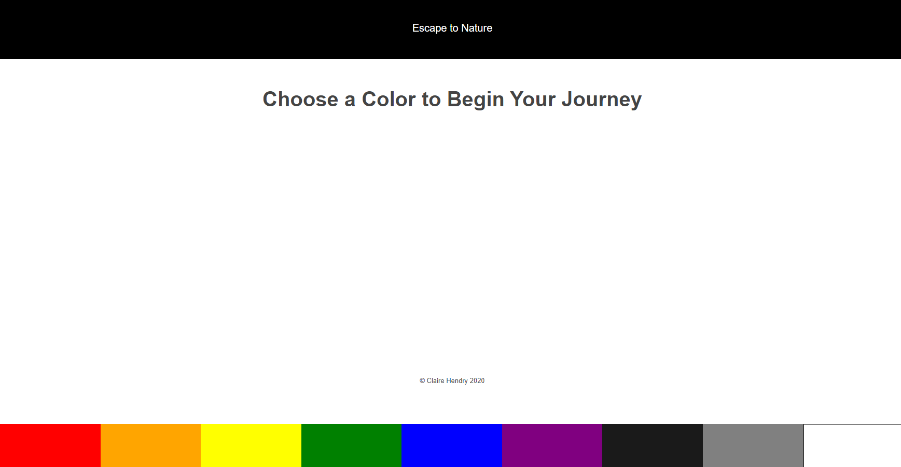
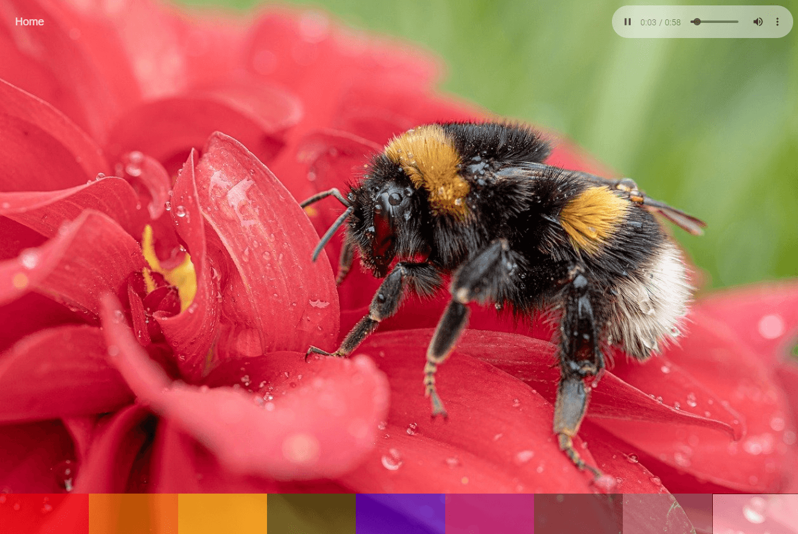
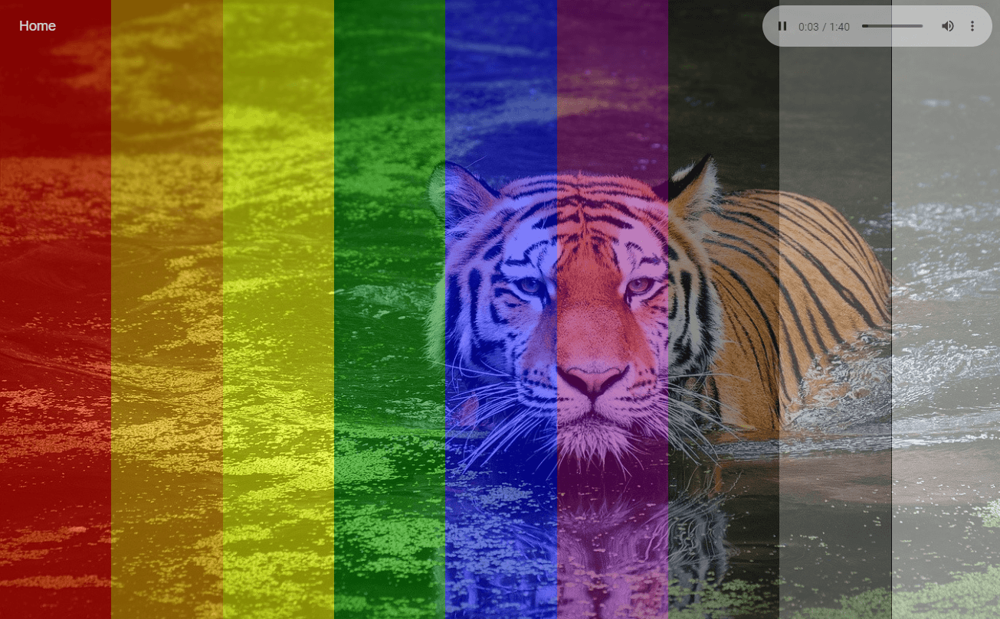

# Escape to Nature
=========================================================

A slideshow and soundscape generator.
Choose a color and relax!

-------------------------------------

## Live App [Here](https://nature-generator-client.now.sh/)

-------------------------------------

## API Documentation

/GET /slideshow/:color will return a slideshow with images selected from a random category defined by color.

/GET /audio/:color/:category selects a random audio track based on color and category selection.

-------------------------------------

## Summary

Escape to Nature uses images and sounds to create a relaxing virtual environment. 
Choose a color and a nature category is selected at random to generate a corresponding slideshow and soundscape.

-------------------------------------

## Screenshots 

-------------------------------------

## Technology Used

This app was created using ReactJS, Node, Express, and PostgreSQL. 

Images courtesy of [Pixabay.com](https://pixabay.com/).

Sounds courtesy of [Freesound.org](https://freesound.org/).

Special sound credit to:
- psubhashish
- florianeichelt [instagram](https://www.instagram.com/florianreichelt/)
- Leandros.Ntounis
- pcaeldries
- everythingsounds

